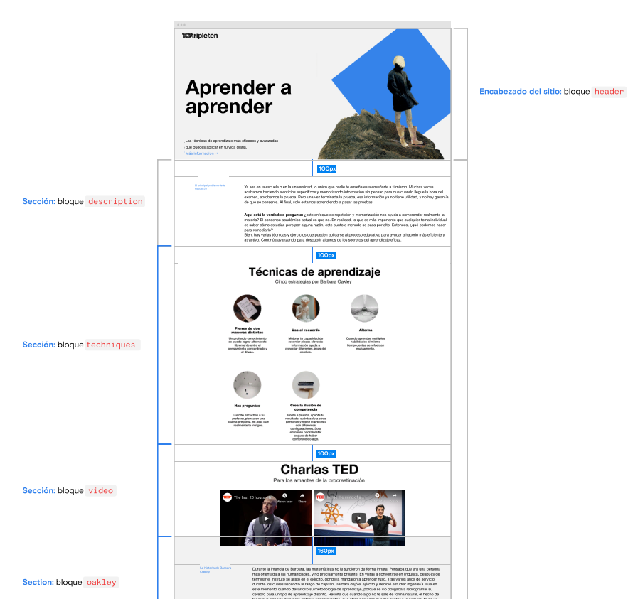

# Tripleten proyecto Aprender a aprender 2

# Proyecto realizado para reforzar el trabajo en equipo, CSS, HTML y BEM, además de pequeñas animaciones y un poco de JS (implementado en un botón de hamburguesa para resoluciones pequeñas). El proyecto fue realizado en VSS (Visual Studio Code).

## El proyecto se adapta a las siguientes resoluciones:

1. 1280px Desktop

2. 800px Tablet

3. 320px Mobile

## Preview del proyecto

## Aprendizaje:

### Este es nuestro primer proyecto realizado en conjunto para, además de reforzar buenas prácticas tanto en HTML y CSS , aprender a delegar tareas y trabajar en equipo, además de resolver merge conflicts dentro del proyecto.

## Tecnologías utilizadas

- **HTML**: Estructura del contenido.
- **CSS**: Estilización y diseño.
- **BEM**: Metodología para nombrar clases en CSS.
- **JavaScript**: Implementación de la funcionalidad del botón de hamburguesa.
- **Visual Studio Code**: Editor de código utilizado para el desarrollo.

## Link de Github pages para visualizar la página: https://melomario57.github.io/Proyecto-Aprender-2/index.html

## Créditos

Este proyecto fue realizado por Mario Melo y Luis González. Agradecemos a todas las personas que contribuyeron con sus comentarios y sugerencias.

- [Mario Melo](https://github.com/Melomario57)
- [Luis González](https://github.com/luis-gn006)

# Esperamos que disfruten de este proyecto. ¡Saludos!
